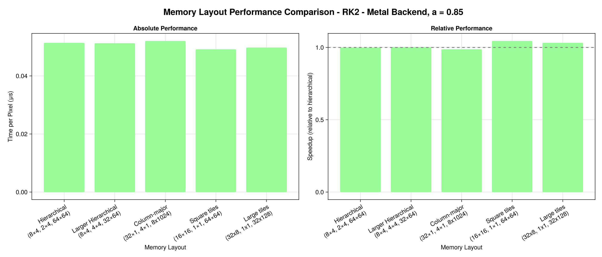
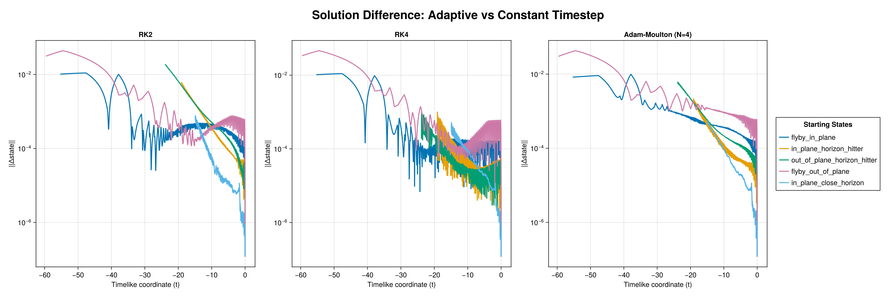
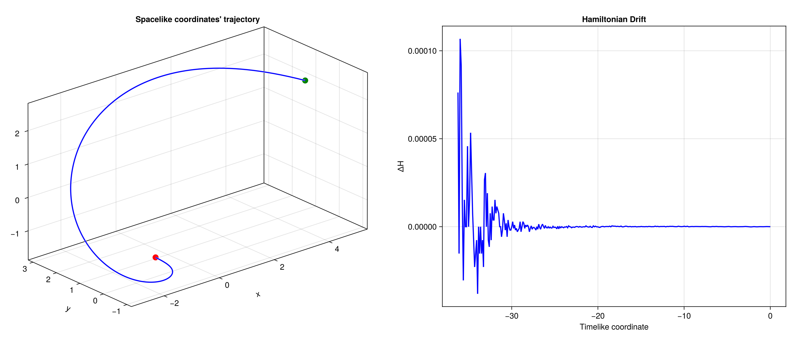
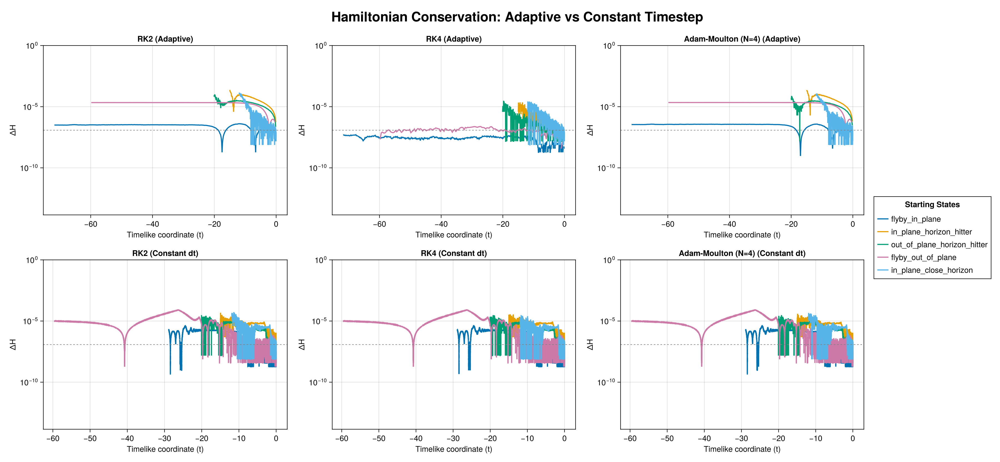
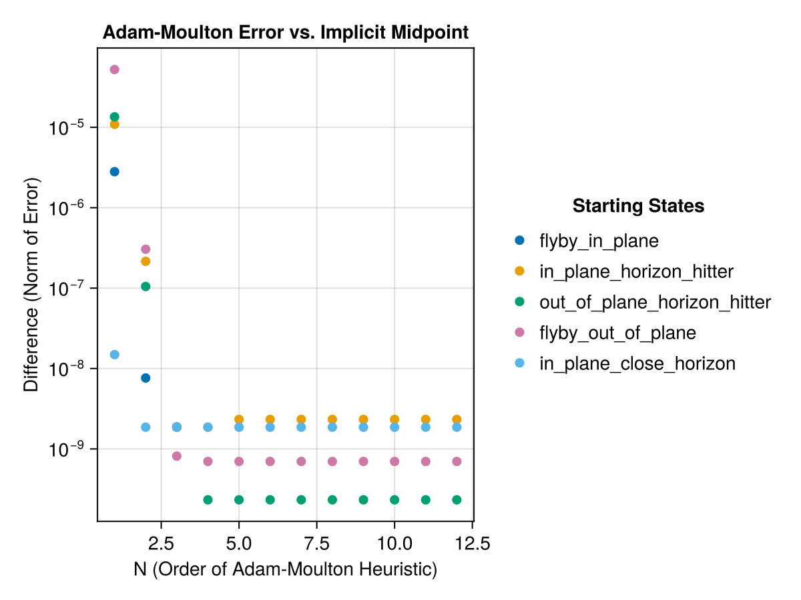

# KerrGeodesics

# Towards real-time visualization of the Kerr spacetime.

# What is KerrGeodesics.jl?

*KerrGeodesics.jl* is a package that aims to facilitiate realtime, and accurate, visualization of the Kerr spacetime. It is primary aimed for visualization and performance (i.e., for instance, the default affine-stepping is based on heuretic), and not neccesiraly for general geodesic calculations, but it supports such in its API. 

It support both CPU and GPU backends thorugh *KernelAbstractions.jl*, and there are plans for specific dispatches for improved CPU performance through *SIMD.jl* usage.

# Implementation details

*KerrGeodesics.jl* supports an extensible API for geodesic integraions in the Kerr spacetime which is currently unstable and is under standardization. However, the actual implementation details are unlikely to change much.

## Frame subdivision

A field-less *struct* (*SubStruct{V, H, MicroNWarps, MicroMWarps, NBlocks, MBlocks}*) is used for code generation to increase warp coherence and pixel sampling on the celestial sphere. This is achieved by re-organgizing the ray order in memory so that they form *(V , H)* shaped micro-tiles, which are grouped in a *(MicroNWarps, MicroMWarps)* grid which form a macro-tile: such form a grid of *(NBlocks, MBlocks)* macrotiles, which compose an individual frame. The rendering kernels launch each macro-tile as a separate block, with the whole video forming the grid/ndrange. The cost of this reordering is relatively light, with just a few modulo operations carried out once per thread.

While the Kerr spacetime only features one (roughly spherical) shadow, and thus warp patterns are fairly predictable, it still leads to rendering speed increases on the order of 3-8% over naive column-major approaches: more more "divergent" spacetimes that feature self-similar shadows or complex, unpredictable or sensitive geodesics, this is likely going to be much higher.

For example, for a high-spin Kerr spacetime and a revolving, closing-in camera, we can benchmark the per-pixel speeds for different layouts.

## Integrator heurestics and correctness

The "default" set of integrators are not based on error estimation, or predictor-corrector schemes, but on a an expandable heurestic API, which estimates the geodesic step-size from the current state. The default method uses a second-order polynomial of the Boyer-Lindquist radial "distance" from the outer event horizon, which leads to (very fast) but potentially divergent steps, i.e. *dt = min(a₀ + a₁(r - rₕ) + a₂(r - rₕ)², max_dt)*

However, we must remember that this library is built for visualization first, and accuracy second. As long as the errors accumulated due to these heurestics remains on the order of a single pixel, they are tolerable.

To verify correctness and the accumulated error, we have compared the (interpolated) coordinate and state differences of a heurestic scaler that used its constant, linear and quadratic terms, and one that only used its constant one (i.e. in effect being a constant-timestep integrator). This serves as a good estimate on the accumulated error of the various heuretic integrators.

We have used parameters of *a₀, a₁, a₂, dt_max = (0.001f0, 0.0125f0, 0.0125f0/2, 0.5f0)* for the heurestic scaler and 5 "typical" intial states (found in *ext/CalibrationExt.jl*). The celestial sphere, and thus the assymptotic flatness termination condition, was placed at *r ~ 60*.

As we can see, the coordinate differences in each case remains under, or near $10^{-2}$ even for second-order methods, which means that such would only cause pixel miss-colorings at extremely high resolutions.

## Physicality of heurestic integrators

Another test of physicality is how well the integrators preserve the Hamiltonian of null geodesics (exactly 0 for all points along the curve). 

As expected, while the heurestic takes smaller steps near the horizon, it is by design forced to take a minimum timestep near the horizon, where the timelike component of the four-velocity grows rapidly. However, for our example calibration data, all example starting states' Hamiltonain drifts a maximum of $10^{-4}$ (closer to $10^{-5}$ for most states) and _remains stable_ in the assymptotic region, indicating good calibration for these set of parameters. 

Since the API for sympletic integrators is still being built, the investigation whether the magnitude of this drift is significant or not is still being investigated.

## Correctness and tradeoffs of GPU-compatible integrators (WIP)

As part of the project, we also developed a GPU compatible set of implicit integrators (even though the Kerr geodesics are unlikely to be stiff). To reduce warp divergence, such are implemented using fixed-point iterations that are unrolled for a fixed number of iterations, forgoing convergence checks for GPU-optimized execution. An example of such an integrator is the Adam-Moulton implicit integrator, which we can parametrize by the number of fixed-point iterations N at compile time.

Exploration shows that for N >= 4 iterations, there is virtually no more improvement in the true implicit value for any of our sampled states (compared against a solver in *NonLinearSolve.jl*) and reaches the limits of _fp32_ precision.

# TODO's

* Better spacial coherence (reorder warp tiles to morton-like order inside the image frame, hopefully will cause less stalls) - Done, clear, if small, effect on benchmarks vs column-major.
* Improve camera abstraction (pass a SubStruct object to the constructor function) - Done.
* Better timestepping heuretics/calibration - Semi-done. API implemented for such.

# Far-shot TODOs

* Pre-render kernel sampler rays for improved warp coherence
* Backend specific texture memory for the sampler (unlikely, its not the bottleneck)
* Enzyme generated pixels/frames - use autodifferentation over camera params + 4-velocity to generate interpolated rays and their termination condion.
* Test CUDA and other backend

# Literature and projects used

* Hamiltonian EoM: https://iopscience.iop.org/article/10.3847/1538-4357/abdc28
* Further EoM: https://iopscience.iop.org/article/10.3847/1538-4365/ac77ef/pdf
* Integrator choices (reduced to just RK4 for now): https://iopscience.iop.org/article/10.3847/1538-4365/aac9ca/pdf?fbclid=IwAR0pORzJb6EvCVdTIWo32F6wxhdd3_eQE_-x8afe94Y8dY_2IH_NuNcPiD0
* Camera tetrad: https://arxiv.org/pdf/1410.7775